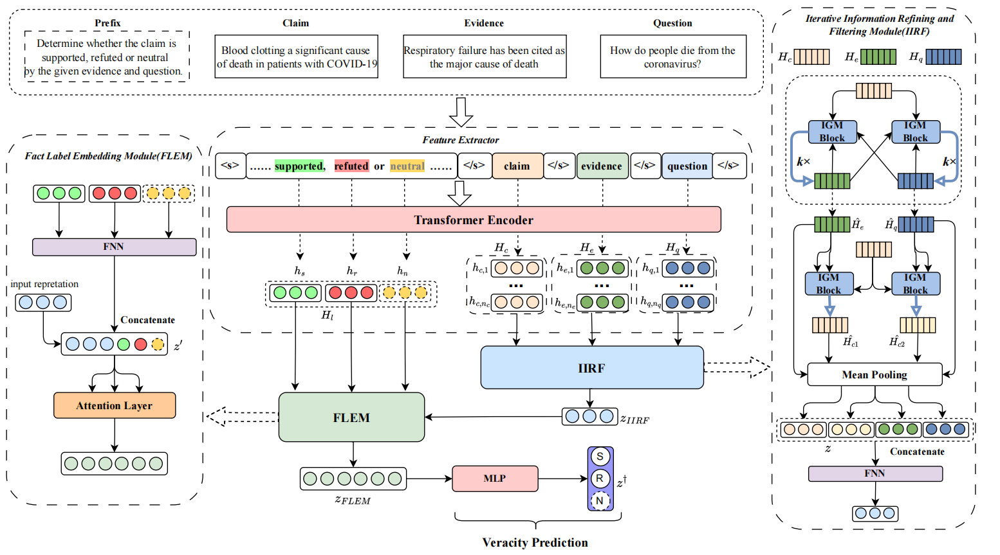

## LI$^{4}$
Code for COLING2024 paper "LI4 : Label-Infused Iterative Information Interacting based Fact Verification in Question-answering Dialogue"

## Introduction
In this paper, we introduce **L**abel-**I**nfused **I**terative **I**nformation **I**nteracting (LI$^{4}$), a novel approach designed for the task of question-answering dialogue based fact verification.
LI$^{4}$ consists of two meticulously designed components, namely the Iterative Information Refining and Filtering Module (IIRF) and the Fact Label Embedding Module (FLEM).
The IIRF  uses the Interactive Gating Mechanism to iteratively filter out the noise of question and evidence, concurrently refining the claim information.
The FLEM is conceived to strengthen the understanding ability of the model towards labels by injecting label knowledge.
We evaluate the performance of the proposed LI$^{4}$ on HEALTHVER, FAVIQ, and COLLOQUIAL.
The experimental results confirm that our LI$^{4}$ model attains remarkable progress, manifesting as a new state-of-the-art performance.



## Preparation

### Installation

```bash
pip install requirements.txt
```

### Pretrain Model Preprocessing

Download [RoBERTa-Large](https://huggingface.co/roberta-large).

### Data Preprocessing
We conduct experiments on three benchmark datasets HEALTHVER ([Sarrouti et al., 2021](https://github.com/sarrouti/healthver)), FAVIQ ([Park et al., 2022](https://github.com/faviq/faviq)) and COLLOQUIAL ([Kim et al., 2021](https://github.com/bckim92/colloquial-claims)).
The synthetic questions for COLLOQUIAL dataset are generated by [Wang et al., 2022](https://drive.google.com/drive/folders/1_JSskGCxLbOvuaqxbi2BsM8MZbpiJd3M?usp=sharing)
Put these datasets into the `data/raw_data` path

```bash
cd process_data

python process_healthver_data.py
python process_faviq_data.py
python process_colloquial_data.py
```


### Training
Training and validation on the healthver dataset:
```bash
sh scripts/train_healthver.sh
```

Training and validation on the faviq a dataset:
```bash
sh scripts/train_faviq_a_gold.sh
```

Training and validation on the faviq r dataset:
```bash
sh scripts/train_faviq_r_gold.sh
```

Training and validation on the colloquial dataset:
```bash
sh scripts/train_colloquial.sh
```


